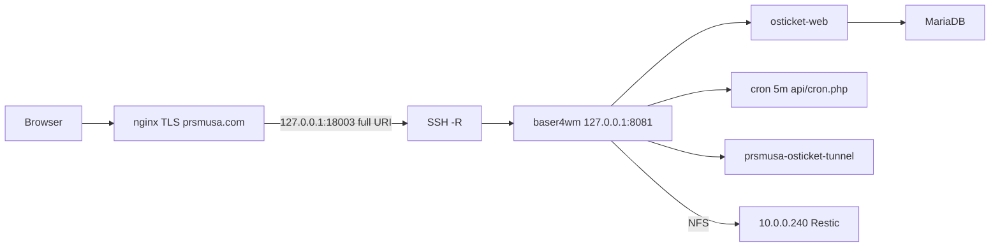

# osTicket on prsmusa.com (deployment plan)

Production deployment for **https://prsmusa.com/ticket/** using baser4wm compute, reverse SSH to the prsmusa.com VPS, and off-host Restic backups to NAS at **10.0.0.240**.

Related PRSM infrastructure: [R4wm/prsm](https://github.com/R4wm/prsm), [R4wm/infra-docs](https://github.com/R4wm/infra-docs).

**Coordination:** PRSM product chat on **Slack** ([workspace channel](https://app.slack.com/client/T0C63084TQE/C0C64Q3JKAN)) for implementation, outages, and cross-app decisions.

**Plan status:** Architecture is sound; **close the P1 items below before calling implementation complete.** Host capacity and NAS state on 2026-10-01 are indicative only—re-verify at deploy time.

---

## Priority findings (must close before production)

| ID | Issue | Required fix |
|----|--------|----------------|
| **P1** | [`bootstrap.php`](../bootstrap.php) forces `display_errors=1` after any `php.ini` | Use **Apache `php_admin_flag display_errors off`** (and `display_startup_errors off`) in production vhost, **or** production-only bootstrap patch. **Verify via HTTP** (probe endpoint or intentional warning)—do not trust `php.ini` alone. PHP precedence: `php_admin_*` beats `ini_set` in many SAPI configs. |
| **P1** | `COPY .` can bake in `.env` beside Compose | Extend [`.dockerignore`](../.dockerignore): `.env`, `.env.*`, `**/.env`, secrets paths. Never place deployment `.env` inside build context root without ignore. **Negative test:** `curl -sI https://prsmusa.com/ticket/.env` → must **404/403** (and block `.git`, `docker-compose*.yml` if ever under web tree). |
| **P1** | Restore drill too weak | Isolated Compose project: **`internal: true` app network** (no mail egress), **separate** config/attachment paths. **Do not** `ports:` publish on an internal-only network (Docker Engine 27.x)—reach the app via **container IP + SSH local forward** or a **separate ingress** service on the default bridge binding `127.0.0.1:8082`. |
| **P2** | nginx proxy headers incomplete | Explicit contract (see [Edge nginx](#edge-nginx-prsmusacom)). Default `proxy_pass` upstream `Host` is **`$proxy_host`**, not `$host`—breaks URL/install detection. |
| **P2** | No recurring backup job | systemd timer or cron: cadence, `flock` overlap prevention, `restic forget` + `restic check`, stale/failure alerts (see [Backups](#off-host-backups--nas-100240)). |
| **P2** | No background scheduler | Host or container **every 5 minutes:** `php /var/www/html/ticket/api/cron.php` (CLI inside web container). Acceptance with **no staff logged in**. |
| **P2** | Install order vs strategy A | Tunnel + nginx + **temporary** setup protection **before** HTTPS install; **permanent** `/ticket/setup/` block **after** install. |
| **P2** | Rollback loses new tickets | **Drain** in-flight HTTP and running cron jobs, then checkpoint. Block **public** writes without blocking **protected operator** access to staff/upgrader (no blanket edge 503 that prevents authenticated upgrade). |
| **P2** | Single Dockerfile breaks dev | **Separate production build** (`Dockerfile.production` or `target: production`) vs dev [`Dockerfile`](../Dockerfile); dev Compose keeps mount at `/var/www/html`. Production startup **self-check** (expected paths exist). |

---

## Implementation tasks

- [ ] `Dockerfile.production` + `docker-compose.production.yml` (8081, no dev bind mount, logging limits)
- [ ] `.dockerignore` secrets; HTTP negative tests for sensitive paths
- [ ] Apache `php_admin_flag` + upload ini; HTTP verify `display_errors` off
- [ ] Config file bind + entrypoint install/production modes
- [ ] NAS server mount/export guards + baser4wm mount; Restic daily + `forget --prune`; backup timer uses `compose --env-file`
- [ ] Cron job for `api/cron.php` (5 min)
- [ ] Tunnel 18003→8081; nginx full header contract; temp auth for setup only
- [ ] Install (strategy A order); permanent setup block; acceptance + **isolated restore drill**
- [ ] infra-docs updates

---

## Capacity and ports (SSH verified 2026-10-01)

| Resource | baser4wm (`10.0.0.68`) | prsmusa.com edge |
|----------|------------------------|------------------|
| CPU | 22 logical CPUs; ~1.3% max 5-min avg (7d metrics) | 1 vCPU |
| RAM available | ~23 GiB of 30.8 GiB | ~634 MiB of 961 MiB |
| Disk available | ~344 GiB | ~18 GiB |
| Production HTTP | **8081** (free) | **18003** (free) |
| 8080 | In use — do not use | — |

| Public path | VPS loopback | baser4wm | Restore drill (example) |
|-------------|--------------|----------|-------------------------|
| `/ticket/` | `127.0.0.1:18003` | `127.0.0.1:8081` | restore test via **8082 ingress** or SSH forward (not internal+publish) |

Tunnel: `-R 127.0.0.1:18003:127.0.0.1:8081 r4wm@172.236.115.113`

---

## Architecture



Standalone repo: [R4wm/osTicket](https://github.com/R4wm/osTicket) on baser4wm (`~/github/osTicket`).

---

## Docker: development vs production (P2 #9)

| | **Development** ([`docker-compose.yml`](../docker-compose.yml)) | **Production** (`docker-compose.production.yml`) |
|---|-----|-----|
| Dockerfile | [`Dockerfile`](../Dockerfile) — docroot `/var/www/html`, bind mount repo | `Dockerfile.production` — app at `/var/www/html/ticket` |
| WORKDIR | `/var/www/html` | `/var/www/html/ticket` |
| Publish | `8080:80` (laptop) | `127.0.0.1:8081:80` only |
| Config | Entrypoint seed under mount | Host file bind → `ticket/include/ost-config.php` |

**Do not** change the dev Dockerfile WORKDIR to `/ticket` without changing dev mounts— that hides the app subtree.

Production entrypoint **startup check:** fail fast if `/var/www/html/ticket/index.php` missing or dev bind mount detected in production compose (`config` grep).

---

## Compose and secrets

- Standalone **`docker-compose.production.yml`** only on baser4wm.
- Before `up`: `docker compose --env-file /var/lib/osticket/.env -f docker-compose.production.yml config`
- DB passwords: **`${MYSQL_PASSWORD:?required}`** / **`${MYSQL_ROOT_PASSWORD:?required}`** in the compose file (never literal defaults).

### Compose env interpolation (required)

Service-level `env_file:` **does not** substitute `${MYSQL_PASSWORD:?required}` in the compose file—interpolation uses the **project environment** ([Compose docs](https://docs.docker.com/compose/environment-variables/set-environment-variables/)).

**Always** pass the deployment env file on the **CLI** (same for timers/cron scripts):

```bash
export COMPOSE_ENV_FILE=/var/lib/osticket/.env  # optional wrapper convention

docker compose --env-file /var/lib/osticket/.env \
  -f docker-compose.production.yml \
  -p osticket \
  up -d

docker compose --env-file /var/lib/osticket/.env \
  -f docker-compose.production.yml \
  -p osticket \
  exec -T web php /var/www/html/ticket/api/cron.php
```

Keep `/var/lib/osticket/.env` **outside** the git/build tree (mode `600`). Do not rely on `env_file:` under `services:` for interpolation unless variables are also exported in the shell invoking Compose.

### Build context secrets (P1 #2)

Add to `.dockerignore` (minimum):

```
.env
.env.*
**/.env
**/.env.*
```

**Release gate:** request must not fetch `/.env`, `/.git`, or compose files under `/ticket/`.

---

## Production image layout

- **`COPY`** application into **`/var/www/html/ticket`**
- Apache **`DocumentRoot`** `/var/www/html` (no `Alias`)
- nginx forwards **full** `/ticket/…` URI

[`get_root_path()`](../include/class.osticket.php) returns `/` when app dir equals `DOCUMENT_ROOT`; physical subdirectory avoids that.

---

## Edge nginx (prsmusa.com) — proxy header contract (P2 #4)

Use explicit headers on **`location ^~ /ticket/`** (no trailing slash on `proxy_pass` URL):

```nginx
location = /ticket {
    return 308 /ticket/;
}

location ^~ /ticket/ {
    client_max_body_size 32m;
    proxy_pass http://127.0.0.1:18003;
    proxy_http_version 1.1;
    proxy_set_header Host $host;
    proxy_set_header X-Real-IP $remote_addr;
    proxy_set_header X-Forwarded-For $proxy_add_x_forwarded_for;
    proxy_set_header X-Forwarded-Proto $scheme;
    proxy_redirect off;
}

# During install ONLY — sibling locations do NOT inherit proxy_pass/headers
# from ^~ /ticket/ (nginx location selection). Duplicate the full proxy block:
location ^~ /ticket/setup/ {
    client_max_body_size 32m;
    proxy_pass http://127.0.0.1:18003;
    proxy_http_version 1.1;
    proxy_set_header Host $host;
    proxy_set_header X-Real-IP $remote_addr;
    proxy_set_header X-Forwarded-For $proxy_add_x_forwarded_for;
    proxy_set_header X-Forwarded-Proto $scheme;
    proxy_redirect off;
    auth_basic "osTicket install";
    auth_basic_user_file /etc/nginx/secrets/osticket-install.htpasswd;
    # OR: satisfy allowlist / VPN source instead of basic auth
}

# Mandatory AFTER install — replace the block above (remove auth + proxy):
# location ^~ /ticket/setup/ { return 404; }
```

**Verify after tunnel up:**

- Installer/strategy A sees **HTTPS** (`X-Forwarded-Proto`) — helpdesk URL must not persist `http://127.0.0.1:…`
- Client IP in staff ticket metadata matches real client when `TRUSTED_PROXIES` configured (measure `REMOTE_ADDR` first)

---

## Config persistence

| Phase | Mount |
|-------|--------|
| Install | Host **file** → `/var/www/html/ticket/include/ost-config.php` (rw) |
| Production | Same file **`:ro`**, **root-owned** on host |

Switching install → production **`:ro` mount requires recreating the web container**—`docker compose restart` does **not** apply changed bind options ([Compose mounts](https://docs.docker.com/reference/compose-file/services/#volume-configuration)). Use `up -d --force-recreate web` after editing compose.

Production entrypoint: no `chmod 0666` when `OSTINSTALLED=TRUE`.

Template: [`docker/ost-config.php`](../docker/ost-config.php) → e.g. `/var/lib/osticket/ost-config.php`.

---

## Helpdesk URL at install (P2 #7)

Installer persists URL from the **HTTP request** ([`class.installer.php`](../setup/inc/class.installer.php)) — not a form field.

| Strategy | When |
|----------|------|
| **A (preferred)** | After **tunnel + nginx + temporary setup protection**, install at `https://prsmusa.com/ticket/setup/` |
| **B** | Local `http://127.0.0.1:8081/ticket/setup/` then fix Helpdesk URL in admin |

**Order for A:** production stack locally healthy → tunnel → nginx (setup route **open but protected**) → install → **permanent** setup 404 → remove temp auth.

---

## Upload limits

| Layer | Single ~20 MiB file |
|-------|---------------------|
| osTicket admin | 20M |
| PHP `upload_max_filesize` | 20M |
| PHP `post_max_size` | **32M** |
| nginx `client_max_body_size` | **32M** |

Scale `post_max_size` and nginx for **multiple** attachments per ticket.

---

## Production errors and logging (P1 #1)

[`bootstrap.php`](../bootstrap.php) lines 30–31 set **`display_errors` and `display_startup_errors` to 1** via `ini_set` — overrides typical `php.ini` production values.

**Production enforcement (pick one, verify over HTTP):**

```apache
# docker/apache-production.conf (Directory or vhost)
php_admin_flag display_errors off
php_admin_flag display_startup_errors off
php_admin_flag log_errors on
```

Alternative: `OSTICKET_PRODUCTION=1` guard in bootstrap (fork change)—only if Apache flags insufficient in your image.

Docker Compose: `logging.options.max-size` / `max-file`.

---

## SMTP and mail safety

- Do not use host Postfix (failed on edge/backend in prior checks).
- Configure osTicket **SMTP** in admin; acceptance test outbound mail on **production** stack only.
- **Restore drill:** internal network **without** SMTP egress; use scrubbed credentials or mail sink.

---

## Background scheduler (P2 #6)

Staff UI [`autocron.php`](../scp/autocron.php) is not sufficient for headless operation.

**Every 5 minutes on baser4wm** (host cron or systemd timer):

```bash
docker compose --env-file /var/lib/osticket/.env \
  -f docker-compose.production.yml \
  -p osticket \
  exec -T web php /var/www/html/ticket/api/cron.php
```

Do not hardcode container names like `osticket-web`—use **project + service** (`-p osticket`, service `web`). ([`api/cron.php`](../api/cron.php) requires CLI; remote equivalent is `POST /api/tasks/cron` with API key.)

**Acceptance:** trigger mail fetch / overdue handling with **no agent logged in** (observe logs or ticket state change).

**Upgrade write freeze:** disable this timer during rollback window.

---

## Off-host backups — NAS `10.0.0.240`

Prior SSH snapshot (re-verify at deploy): RAID1 `/mnt/storage`, ~4.1 TiB free on array; **root FS ~88% full**—fail closed if NFS mount wrong.

### Storage setup (before launch)

1. NAS path: `/mnt/storage/production-backups/baser4wm/osticket`
2. baser4wm mount: `/mnt/production-backups` (NFSv4, `hard,_netdev,nosuid,nodev,noexec`)
3. Restrict export to `10.0.0.68`; remediate overlapping LAN-wide `/mnt/storage` NFS/SMB paths
4. **NAS server (10.0.0.240):** export only when the array is mounted—systemd **`Requires=` / `After=`** on `/mnt/storage` before `nfs-server` export; use export **`fsid`**, **`mountpoint=/mnt/storage`** (or export the subdirectory with explicit `mp=` ) so clients cannot write into an empty mountpoint if the array is down ([exports(5)](https://linux.die.net/man/5/exports)).
5. **baser4wm client:** `findmnt` checks expected NFS source + filesystem type before Restic—**supplement**, not replace, server-side safeguards. Alert + retain local staging if mount missing. **Test:** stop array export or simulate unmounted `/mnt/storage` and confirm backup job **fails closed** (no writes to local disk masquerading as NAS).

### Backup payload

- MariaDB dump (`--single-transaction` where valid)
- `ost-config.php` (**`SECRET_SALT`**)
- Deployment metadata (git SHA, image tag—no secret values)
- Attachments per chosen storage plugin (filesystem path documented)

### Restic

- Repo on mounted NAS path; password file mode `600` + off-host recovery copy
- Retention: **daily backups, keep last 7 days only** — after each successful backup: **`restic forget --keep-within 7d --prune`** ( **`--prune`** reclaims storage; run forget+prune on schedule if separated)
- Do **not** use `--keep-daily 7` as an equivalent—it keeps one snapshot per calendar day and can drop a **same-day pre-upgrade** snapshot when another backup runs later that day
- **Pre-upgrade** snapshot mandatory; keep until upgrade verified (may require a **manual** snapshot tag outside the daily forget window if upgrading twice in one day)

### Recurring job (P2 #5)

| Item | Recommendation |
|------|----------------|
| Cadence | **Once per day** full Restic backup (e.g. 03:15 local)—DB dump, config, attachments/metadata in staging, then `restic backup` |
| Retention | **`restic forget --keep-within 7d --prune`** after each successful backup (or daily scheduled forget+prune job) |
| Overlap | `flock -n /var/lib/osticket/backup.lock` — skip or alert if previous run active |
| Maintenance | Weekly `restic check`; periodic test `restic restore --verify` to temp dir (e.g. before major upgrades) |
| Alerts | No successful backup in **26h**; mount check failed; Restic non-zero exit; NAS free space below threshold |

### Restore drill (P1 #3)

Separate Compose project **`osticket-restore-test`** (e.g. `-p osticket-restore`):

- **`web` + `db` on an `internal: true` network** — no SMTP/IMAP egress; scrubbed or dummy mail settings
- **Do not** attach `ports:` to services on that internal network only (Docker Engine **27.1.1** will not expose them as expected)
- **Access (pick one):**
  - **SSH local forward** from baser4wm to the restore `web` container IP: `ssh -L 8082:<container_ip>:80 localhost` then browse `http://127.0.0.1:8082/ticket/`
  - **Ingress sidecar:** small proxy service on the **default bridge** with `127.0.0.1:8082:80` → `http://web:80` while `web` stays internal-only
- Bind **different** host paths: `/var/lib/osticket/restore-test/ost-config.php`, attachment dir, fresh DB volume
- Restore Restic snapshot; login; open ticket/attachment
- **Do not** point restore stack at production SMTP/IMAP credentials

---

## Tunnel

`~/bin/prsmusa-osticket-tunnel`: `-R 127.0.0.1:18003:127.0.0.1:8081`, reconnect loop, `ExitOnForwardFailure`, keepalives, dedicated key, `permitlisten="127.0.0.1:18003"`, `@reboot` + `flock`.

---

## Updates and rollback (P2 #8)

1. Announce maintenance window.
2. **Drain:** wait for in-flight HTTP to finish (or short grace); **stop `api/cron.php` timer** and let the current cron run complete (or wait bounded timeout).
3. **Public write freeze** without blocking operators:
   - Edge: disable **client** ticket creation (maintenance page on `/ticket/` **or** nginx `limit_except` patterns)—**not** a blanket `503` on all `/ticket/` traffic if that blocks **staff login / web upgrader**
   - Prefer: stop tunnel or edge proxy to clients while keeping **`127.0.0.1:8081`** reachable on baser4wm for authenticated staff upgrade
   - Disable mail **fetch** (cron stopped) to avoid ingestion during checkpoint
4. Restic backup + record git SHA / image tag (**checkpoint**).
5. Deploy new image; run **web upgrader** via protected path; smoke test.
6. **Success:** re-enable tunnel/edge, cron, mail. **Failure:** redeploy previous image; **Restic restore** DB (+ config/files if needed); then resume.

Tickets created after checkpoint but before failed upgrade are **lost on DB restore**—freeze minimizes that window.

---

## Recommended implementation order

1. **Production Dockerfile + standalone Compose** (subpath layout, secrets ignore, Apache admin flags, upload ini, startup path check).
2. **Config host file + entrypoint** modes.
3. **NAS** export/mount hardening + Restic repo + **backup timer/alerts**.
4. **Local production stack** on `127.0.0.1:8081` — subpath smoke, HTTP verify errors hidden.
5. **Tunnel** 18003→8081.
6. **nginx** full headers + **temporary** setup protection (no permanent 404 yet).
7. **Install strategy A** at `https://prsmusa.com/ticket/setup/`.
8. **Permanent** `/ticket/setup/` 404; remove temp auth.
9. **Cron** timer + SMTP test (if required).
10. **Acceptance** + **isolated restore drill** (internal network + ingress/SSH, no mail egress).
11. **infra-docs** + optional homepage link.

---

## Acceptance checklist

- [ ] HTTP probe: **`display_errors` off** (not just ini file)
- [ ] `GET /ticket/.env` (and similar) **blocked**
- [ ] `ROOT_PATH` / assets under `/ticket/`
- [ ] Helpdesk URL **`https://prsmusa.com/ticket`** (strategy A or admin fix)
- [ ] Staff login, client submit, attachment (20M / 32M request)
- [ ] **`api/cron.php`** effective with no staff session
- [ ] SMTP test (production credentials only on prod stack)
- [ ] Container restart; config not writable by www-data
- [ ] Tunnel drop/recovery
- [ ] Scheduled Restic backup + stale-backup alert tested
- [ ] Restore drill: **internal** network, **ingress or SSH forward**, **no real mail**; checksum/readback

---

## infra-docs updates

- Ports `/ticket/` → `18003` → `8081`; restore test `8082`; 8080 conflict
- Tunnel script + backup NAS paths + timer
- NFS overlap remediation note

---

## Risk log

| Risk | Mitigation |
|------|------------|
| Errors shown to browsers | `php_admin_flag` + HTTP verify |
| Secrets in image / URL | `.dockerignore` + negative HTTP tests |
| Restore sends live mail | internal network + no SMTP egress |
| Wrong install URL | Strategy A ordering + header contract |
| Lost tickets on rollback | Write freeze through verification |
| Dev/prod Dockerfile drift | Separate files + startup check |
| Backup never runs | systemd timer + stale alert |

---

*Last revised: 2026-10-01. Implementation starts only after P1 gates are built into the fork and verified.*
